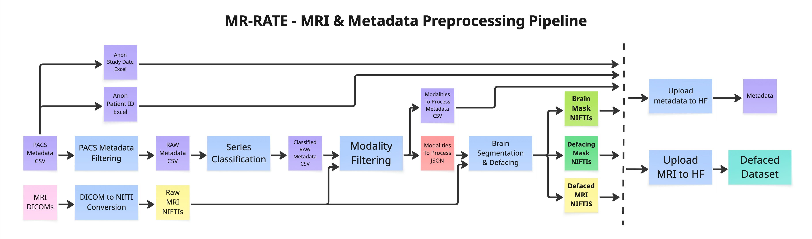

# MR-RATE – Data Preprocessing Submodule

This submodule contains the data preprocessing pipelines and scripts used for building the [MR-RATE dataset](https://huggingface.co/datasets/Forithmus/MR-RATE), a novel dataset of brain and spine MRI volumes paired with corresponding radiology text reports and metadata.

➡️ To start using the dataset right away, refer to the [Dataset Guide](docs/dataset_guide.md) and [Downloading Dataset](#downloading-dataset).

## 🧠 Overview

In MR-RATE, brain and spine MRI examinations are acquired from patients using MRI scanners and organised into multiple imaging sequence categories, including T1-weighted, T2-weighted, FLAIR, SWI, and MRA, constituting the series of a study. Then, each study is paired with associated metadata and a radiology report, which is produced by the radiologists during clinical interpretation. Together, these components constitute the MR-RATE dataset for multimodal brain and spine MRI research. Via preprocessing steps applied here, our goal is to convert raw, heterogeneous clinical data into a clean, anonymized, and spatially standardized collection that is ready for downstream machine learning and neuroscientific research.

## 📁 Directory Structure

```plaintext
data-preprocessing/
├── README.md
├── pyproject.toml
├── environment.yml
├── data/
│   ├── raw/                               # Raw PACS CSVs, DICOMs, NIfTIs, mapping Excels
│   ├── interim/                           # Intermediate outputs from each step
│   └── processed/                         # Final processed studies
├── logs/                                  # Per-batch log files
├── run/
│   ├── run_mri_preprocessing.py           # Orchestrates steps 1–5
│   ├── run_mri_upload.py                  # Orchestrates steps 6–7
│   ├── utils.py                           # Shared runner utilities
│   └── configs/
│       └── mri_batch00.yaml               # Batch config template
├── scripts/
│   └── hf/
│       ├── download.py                    # Download MR-RATE batches from Hugging Face
│       └── merge_downloaded_repos.py      # Merge derivative repos into MR-RATE repo on study level
├── src/
│   └── mr_rate_preprocessing/
│       ├── configs/
│       │   ├── config_mri_preprocessing.py    # Pipeline constants and thresholds
│       │   └── config_metadata_columns.json   # DICOM metadata column definitions
│       ├── mri_preprocessing/
│       │   ├── dcm2nii.py                     # Step 1: DICOM-to-NIfTI conversion
│       │   ├── pacs_metadata_filtering.py     # Step 2: metadata filtering
│       │   ├── series_classification.py       # Step 3: series classification
│       │   ├── modality_filtering.py          # Step 4: modality filtering
│       │   ├── brain_segmentation_and_defacing.py  # Step 5: HD-BET + Quickshear
│       │   ├── zip_and_upload.py              # Step 6: zip & upload MRI to HF
│       │   ├── prepare_metadata.py            # Step 7: metadata preparation & upload to HF
│       │   ├── hdbet.py                       # HD-BET brain segmentation wrapper
│       │   ├── quickshear.py                  # Quickshear defacing wrapper
│       │   └── utils.py                       # Shared logging and helper utilities
│       ├── registration/
│       │   ├── registration.py            # ANTs co-registration and atlas registration
│       │   └── upload.py                  # Zip registration outputs and upload to HF
│       └── reports_preprocessing/             # Report anonymization, translation, structuring, QC
│           ├── 01_anonymization/
│           ├── 02_translation/
│           ├── 03_translation_qc/
│           ├── 04_structuring/
│           ├── 05_structure_qc/
│           └── utils/
├── tests/                                 # Coming soon
└── figures/                               # Figures for submodule
```

## 🛠️ Preprocessing Pipelines

### MRI & Metadata Preprocessing

Raw DICOM exports from PACS are noisy, heterogeneous, and contain patient-identifiable information. This stage converts them into clean, anonymized NIfTI volumes, classifies each series by modality, filters out low-quality acquisitions, removes facial features, and uploads the processed volumes along with a cleaned metadata table to Hugging Face.



1. **[DICOM to NIfTI Conversion](src/mr_rate_preprocessing/mri_preprocessing/dcm2nii.py)** — Reads a CSV of DICOM folder paths, extracts the AccessionNumber from each folder's first DICOM file, and runs `dcm2niix` to produce gzip-compressed NIfTI files and JSON sidecars organised into per-accession subfolders.

2. **[PACS Metadata Filtering](src/mr_rate_preprocessing/mri_preprocessing/pacs_metadata_filtering.py)** — Loads raw DICOM metadata exports from PACS, enforces required columns, retains as many optional columns as possible, and removes rows with missing critical identifiers or duplicate series.

3. **[Series Classification](src/mr_rate_preprocessing/mri_preprocessing/series_classification.py)** — Assigns each series a modality label (T1w, T2w, SWI, …) and additional flags (`is_derived`, `sequence_family`, …) using a 5-level rule hierarchy: DICOM diffusion tags → vendor-specific sequence IDs → scanning sequence parameters → description keyword matching → numeric fallback.

4. **[Modality Filtering](src/mr_rate_preprocessing/mri_preprocessing/modality_filtering.py)** — Filters classified series against acceptance criteria (modality type, acquisition plane, image shape/FOV, patient age) defined in [mri preprocessing config](src/mr_rate_preprocessing/configs/config_mri_preprocessing.py). Reads NIfTI headers in parallel to measure shape and spacing, constructs standardized modality IDs (e.g. `t1w-raw-sag`), and designates one T1w series per study as the center modality to be used later in registration and segmentation.

5. **[Brain Segmentation & Defacing](src/mr_rate_preprocessing/mri_preprocessing/brain_segmentation_and_defacing.py)** — Using an adapted and parallelized version of the [BrainLesion Suite Preprocessing Module (BrainLes-Preprocessing Toolkit)](https://github.com/BrainLesion/preprocessing), a binary brain mask is predicted for each series with [HD-BET](https://github.com/MIC-DKFZ/HD-BET), and defacing is then applied with [Quickshear](https://github.com/nipy/quickshear) to remove identifiable facial features. Brain masks and defacing masks are saved alongside the defaced volumes.
> For details on adaptations to `BrainLes-Preprocessing`, see [Why is this specific MRI preprocessing?](docs/dataset_guide.md#why-is-this-specific-mri-preprocessing).

6. **[Upload MRI to HF](src/mr_rate_preprocessing/mri_preprocessing/zip_and_upload.py)** — Validates that all expected modality files (image, brain mask, defacing mask) are present for each study, anonymizes study IDs to de-identified UIDs, zips each processed study folder, and uploads the zip files to the Hugging Face dataset repository in parallel. Supports the [Xet](https://huggingface.co/docs/hub/storage-backends) high-performance transfer backend.

7. **[Upload metadata to HF](src/mr_rate_preprocessing/mri_preprocessing/prepare_metadata.py)** — Validates that all expected modality files (image, brain mask, defacing mask) are present for each study, merges patient IDs and anonymized study dates from mapping files, drops sensitive columns, and uploads a clean metadata CSV to Hugging Face.

---

### Radiology Report Preprocessing

<!-- Figure placeholder: MR-RATE report preprocessing pipeline -->

Raw Turkish radiology reports are converted to structured English through an iterative LLM-based pipeline using Qwen3.5-35B-A3B-FP8 via vLLM. Each step follows a **run → automated QC → retry → manual review** loop until quality thresholds are met. See [`reports_preprocessing/README.md`](src/mr_rate_preprocessing/reports_preprocessing/README.md) for full pipeline documentation.

1. **[Anonymization](src/mr_rate_preprocessing/reports_preprocessing/01_anonymization/anonymize_reports_parallel.py)** — Replaces patient names, dates, hospitals, and other PHI with deterministic tokens (`[patient_1]`, `[date_1]`, etc.). Validated to ensure no PHI leakage.

2. **[Translation](src/mr_rate_preprocessing/reports_preprocessing/02_translation/translate_reports_parallel.py)** — Turkish-to-English translation preserving medical terminology, anonymization tokens, and report structure.

3. **[Translation QC](src/mr_rate_preprocessing/reports_preprocessing/03_translation_qc/)** — LLM-based quality check for translation completeness and accuracy, rule-based detection of remaining Turkish text, and automated retranslation of failures.

4. **[Structuring](src/mr_rate_preprocessing/reports_preprocessing/04_structuring/)** — Extracts four sections from each report: `clinical_information`, `technique`, `findings`, and `impression`. Uses a two-pass approach with a no-think fallback for reports where chain-of-thought reasoning exhausts the token budget.

5. **[Structure QC](src/mr_rate_preprocessing/reports_preprocessing/05_structure_qc/)** — LLM-based verification comparing structured output against the raw report, checking for missing content, hallucinations, and misplaced sections.

---

### Registration

Because different modalities within a study are acquired in different orientations and resolutions, they must be spatially aligned before any cross-modal analysis can be performed. Co-registration to a shared T1w reference and subsequent normalization to the MNI152 atlas puts all volumes into a common coordinate space, enabling direct voxel-wise comparisons across modalities and subjects, and allowing researchers to readily apply the registered data to their specific downstream tasks without additional alignment steps.

<!-- Figure placeholder: MR-RATE registration pipeline -->

After MRI & Metadata Preprocessing is run, processed and uploaded studies are downloaded to a separate server where registration is performed independently.

1. **[Registration](src/mr_rate_preprocessing/registration/registration.py)** —  In a similar approach to [BrainLesion Suite Preprocessing Module (BrainLes-Preprocessing Toolkit)](https://github.com/BrainLesion/preprocessing), within each study, moving modalities are co-registered to the T1-weighted center modality using [ANTs](https://github.com/antsx/ants). The center modality is then registered to the [MNI152 (ICBM 2009c Nonlinear Symmetric)](https://nist.mni.mcgill.ca/icbm-152-nonlinear-atlases-2009/) atlas, and all co-registered modalities are transformed to atlas space.
> For details on adaptations to `BrainLes-Preprocessing`, see [Why is this specific MRI preprocessing?](docs/dataset_guide.md#why-is-this-specific-mri-preprocessing).

2. **[Upload to HF](src/mr_rate_preprocessing/registration/upload.py)** — Zips each registered study folder, and uploads the zip files to the Hugging Face dataset repository in parallel.

---

### Multi-label Brain Segmentation

<!-- Figure placeholder: MR-RATE multi-label brain segmentation pipeline -->

*(Coming soon)* Similar to registration, after MRI & Metadata Preprocessing is run, processed and uploaded studies are downloaded to a separate server where segmentation is performed independently. Voxel-wise anatomical segmentations are predicted for center modality volumes in native space using [NV-Segment-CTMR](https://github.com/NVIDIA-Medtech/NV-Segment-CTMR) model based on [VISTA3D](https://github.com/Project-MONAI/VISTA/tree/main/vista3d), supporting region-of-interest analysis and various downstream tasks.

## ⬇️ Standalone Data Downloading Scripts

- **[Download Repos](scripts/hf/download.py)** — Downloads data from any combination of the four MR-RATE HuggingFace repositories ([Forithmus/MR-RATE](https://huggingface.co/datasets/Forithmus/MR-RATE), [Forithmus/MR-RATE-coreg](https://huggingface.co/datasets/Forithmus/MR-RATE-coreg), [Forithmus/MR-RATE-atlas](https://huggingface.co/datasets/Forithmus/MR-RATE-atlas), [Forithmus/MR-RATE-vista-seg](https://huggingface.co/datasets/Forithmus/MR-RATE-vista-seg)) into per-repo output directories under a shared base, with optional concurrent on-the-fly unzipping and zip deletion. Supports resumable batch-level downloads via `snapshot_download` and the Xet high-performance transfer backend.

- **[Merge Downloaded Repos](scripts/hf/merge_downloaded_repos.py)** — Merges extracted study folders from downloaded derivative repos (`MR-RATE-coreg/`, `MR-RATE-atlas/`, `MR-RATE-vista-seg/`) into the base `MR-RATE/` directory by moving each batch in-place. Mirrors the interface of `download.py`: same `--output-base`, same modality flags (`--coreg`, `--atlas`, `--vista-seg`), and same `--batches` selector. Filenames across repos are non-colliding by design, so subdirs that don't yet exist in the destination are renamed wholesale (instant move), while subdirs that already exist (e.g. `transform/`) are merged file-by-file.

## ⚙️ Installation

1. **Clone the repository:**

   ```bash
   git clone https://github.com/Forithmus/MR-RATE.git
   cd MR-RATE/data-preprocessing
   ```

2. **Create and activate conda environment, install the package in editable mode:**

   ```bash
   conda env create -f environment.yml
   conda activate mr-rate-preprocessing
   pip install -e .
   ```

3. **(Optional) Set up Hugging Face credentials:**

   Required for uploading to or downloading from the Hugging Face dataset repositories.

   ```bash
   hf auth login
   # or: export HF_TOKEN=<your_token>
   ```

## 🧩 How to Use

### MRI & Metadata Preprocessing

All MRI pipeline steps are driven by a single YAML config file. Batch configs are located at `run/configs/`. A template config for `batch00` is provided at `run/configs/mri_batch00.yaml`.

1. **Set up your config file** by copying `mri_batch00.yaml` and filling in your input/output paths, Hugging Face repo ID, and processing parameters.

2. **Run MRI preprocessing** (steps 1–5: DICOM conversion → metadata filtering → classification → modality filtering → segmentation & defacing):

   ```bash
   python run/run_mri_preprocessing.py --config run/configs/<your_config>.yaml
   ```

   Output structure after step 5:

   ```plaintext
   data/raw/
   └── batchXX/
       └── batchXX_raw_niftis/
           └── <AccessionNumber>/
               └── <SeriesNumber>_<SeriesDescription>.nii.gz                # Step 1: Series of a study as NIfTI files

   data/interim/
   └── batchXX/
       ├── batchXX_raw_metadata.csv                            # Step 2: filtered PACS metadata
       ├── batchXX_raw_metadata_classified.csv                 # Step 3: per-series modality labels
       ├── batchXX_raw_metadata_classification_summary.csv     # Step 3: classification summary
       ├── batchXX_modalities_to_process.json                  # Step 4: accepted modality list
       └── batchXX_modalities_to_process_metadata.csv          # Step 4: accepted modality metadata

   data/processed/
   └── batchXX/
       └── <study_id>/
           ├── img/
           │   └── <study_id>_<modality_id>.nii.gz               # Defaced native images (uint16 or float32)
           └── seg/
               ├── <study_id>_<modality_id>_brain-mask.nii.gz    # Brain masks (uint8)
               └── <study_id>_<modality_id>_defacing-mask.nii.gz # Defacing masks (uint8)
   ```

3. **Run upload** (steps 6–7: zip & upload studies → prepare & upload metadata):

   ```bash
   python run/run_mri_upload.py --config run/configs/<your_config>.yaml
   ```

   Output structure after step 7:

   ```plaintext
   data/processed/
   ├── batchXX_metadata.csv             # Anonymized metadata CSV for the batch
   └── MR-RATE_batchXX/
       └── mri/
           └── batchXX/
               └── <study_uid>.zip      # Each zip preserves the internal folder structure:
                                        #   <study_uid>/
                                        #     img/
                                        #       <study_uid>_<series_id>.nii.gz
                                        #     seg/
                                        #       <study_uid>_<series_id>_brain-mask.nii.gz
                                        #       <study_uid>_<series_id>_defacing-mask.nii.gz
   
   ```

   Hugging Face repository structure after step 7:

   ```plaintext
   <repo_id> (Hugging Face dataset)
   ├── mri/
   │   └── batchXX/
   │       └── <study_uid>.zip          # Uploaded by step 5
   └── metadata/
       └── batchXX_metadata.csv         # Uploaded by step 6
   ```

Intermediate outputs are written to the paths defined in your config file, following the `data/interim/` → `data/processed/` convention.

---

### Radiology Report Preprocessing

Each pipeline step is a standalone parallel script designed for SLURM execution. Scripts are located in `src/mr_rate_preprocessing/reports_preprocessing/` and documented in its own [`README.md`](src/mr_rate_preprocessing/reports_preprocessing/README.md).

Steps are run sequentially, with each step's output feeding the next. Within each step, the iterative QC loop is repeated until quality thresholds are met:

```bash
# 1. Anonymize raw Turkish reports
srun python src/mr_rate_preprocessing/reports_preprocessing/01_anonymization/anonymize_reports_parallel.py \
    --input_file data/raw/turkish_reports.csv --output_dir anonymized_shards

# 2. Translate to English
srun python src/mr_rate_preprocessing/reports_preprocessing/02_translation/translate_reports_parallel.py \
    --input_file anonymized_reports.csv --output_dir translated_shards

# 3. QC translations, retranslate failures, repeat
srun python src/mr_rate_preprocessing/reports_preprocessing/03_translation_qc/quality_check_parallel.py \
    --input_file translated_reports.csv --output_dir qc_shards

# 4. Structure into sections
srun python src/mr_rate_preprocessing/reports_preprocessing/04_structuring/structure_reports_parallel.py \
    --input_file translated_reports.csv --output_dir structure_shards

# 5. Verify structured output
srun python src/mr_rate_preprocessing/reports_preprocessing/05_structure_qc/qc_llm_verify.py \
    --input_file structured_reports.csv --output_dir qc_verify_shards

# Merge any step's shards
python src/mr_rate_preprocessing/reports_preprocessing/utils/merge_shards.py \
    --shard_dir <shard_dir> --output <merged.csv>
```

---

### Registration

No runner scripts or config for registration pipeline as there are two blocks to be run independently.

1. **Download a batch from Hugging Face:**

   ```bash
   python scripts/hf/download.py \
       --batches XX --unzip --delete-zips --no-reports --xet-high-perf
   ```

   See `python scripts/hf/download.py --help` for the full list of options (workers, timeout, output base, etc.).

   Output structure after step 1:

   ```plaintext
   data/MR-RATE/
   ├── mri/
   │   └── batchXX/
   │       └── <study_uid>/
   │           ├── img/
   │           │   └── <study_uid>_<series_id>.nii.gz
   │           └── seg/
   │               ├── <study_uid>_<series_id>_brain-mask.nii.gz
   │               └── <study_uid>_<series_id>_defacing-mask.nii.gz
   └── metadata/
       └── batchXX_metadata.csv
   ```

2. **Run registration** (co-registration to center modality + atlas registration to MNI152):

   ```bash
   python src/mr_rate_preprocessing/registration/registration.py \
       --input-dir data/MR-RATE/mri/batchXX \
       --metadata-csv data/MR-RATE/metadata/batchXX_metadata.csv \
       --output-dir data/MR-RATE-reg \
       --num-processes 4 \
       --threads-per-process 4 \
       --verbose
   ```

   For large batches, studies can be split across multiple independent jobs (e.g., SLURM array jobs) using `--total-partitions` and `--partition-index`:

   Output structure after step 2:

   ```plaintext
   data/MR-RATE-reg/
   ├── MR-RATE-coreg_batchXX/
   │   └── mri/
   │       └── batchXX/
   │           └── <study_uid>/
   │               ├── coreg_img/
   │               │   ├── <study_uid>_<center_series_id>.nii.gz              # Center modality (unchanged copy from native) (uint16 or float32)
   │               │   └── <study_uid>_coreg_<moving_series_id>.nii.gz        # Moving modalities warped to center space (float32)
   │               ├── coreg_seg/
   │               │   ├── <study_uid>_<center_series_id>_brain-mask.nii.gz   # Center modality brain mask (unchanged copy from native) (uint8)
   │               │   └── <study_uid>_<center_series_id>_defacing-mask.nii.gz # Center modality defacing mask (unchanged copy from native) (uint8)
   │               └── transform/
   │                   └── M_coreg_<moving_series_id>.mat                     # Moving→center ANTs transform (one per moving modality)
   │
   └── MR-RATE-atlas_batchXX/
       └── mri/
           └── batchXX/
               └── <study_uid>/
                   ├── atlas_img/
                   │   ├── <study_uid>_atlas_<center_series_id>.nii.gz        # Center modality in atlas space (float32)
                   │   └── <study_uid>_atlas_<moving_series_id>.nii.gz        # Moving modalities in atlas space (float32)
                   ├── atlas_seg/
                   │   ├── <study_uid>_atlas_<center_series_id>_brain-mask.nii.gz    # Brain mask in atlas space (uint8)
                   │   └── <study_uid>_atlas_<center_series_id>_defacing-mask.nii.gz # Defacing mask in atlas space (uint8)
                   └── transform/
                       └── M_atlas_<center_series_id>.mat                     # Center→atlas ANTs transform
   ```

3. **Zip and upload to Hugging Face:**

   ```bash
   # Zip and upload co-registration outputs
   python src/mr_rate_preprocessing/registration/upload.py \
       --input-dir data/MR-RATE-reg/MR-RATE-coreg_batchXX \
       --zip-suffix _coreg \
       --repo-id <repo_id_coreg> \
       --zip-workers 8 --hf-workers 16 --xet-high-perf --verbose

   # Zip and upload atlas outputs
   python src/mr_rate_preprocessing/registration/upload.py \
       --input-dir data/MR-RATE-reg/MR-RATE-atlas_batchXX \
       --zip-suffix _atlas \
       --repo-id <repo_id_atlas> \
       --zip-workers 8 --hf-workers 16 --xet-high-perf --verbose
   ```

   Upload progress is tracked in a `.cache/` folder inside each zipped directory for resumability. Use `--delete-zips` to remove the zipped folder after a successful upload. See `python src/mr_rate_preprocessing/registration/upload.py --help` for the full list of options.

   Output structure after step 3:

   ```plaintext
   data/MR-RATE-reg/
   ├── MR-RATE-coreg_batchXX_zipped/
   │   └── mri/
   │       └── batchXX/
   │           └── <study_uid>_coreg.zip   # zip root: <study_uid>/coreg_img/, coreg_seg/, transform/
   │
   └── MR-RATE-atlas_batchXX_zipped/
       └── mri/
           └── batchXX/
               └── <study_uid>_atlas.zip   # zip root: <study_uid>/atlas_img/, atlas_seg/, transform/
   ```

   Hugging Face repository structure after step 3:

   ```plaintext
    <repo_id_coreg> (Hugging Face dataset)
   └── mri/
       └── batchXX/
           └── <study_uid>_coreg.zip       # Uploaded by coreg upload

   <repo_id_atlas> (Hugging Face dataset)
   └── mri/
       └── batchXX/
           └── <study_uid>_atlas.zip       # Uploaded by atlas upload
   ```

---

### Multi-label Brain Segmentation

*(Coming soon)*

---

### Downloading Dataset

For detailed overview, refer to the [MR-RATE dataset](https://huggingface.co/datasets/Forithmus/MR-RATE) and [Dataset Guide](docs/dataset_guide.md).

1. **Follow [⚙️ Installation](#%EF%B8%8F-installation) steps 1 & 3 (if you haven't done so already)**

All four repositories are gated. Make sure you have access.


2. **Download Repos**

[`scripts/hf/download.py`](scripts/hf/download.py) is a standalone script that downloads any combination of data from the four MR-RATE repositories. Each repo is written to its own subdirectory under `--output-base` (default: `./data`).

| Flag | Default | Repository | Zip suffix | Output directory |
|------|---------|-----------|------------|-----------------|
| `--native` | on | `Forithmus/MR-RATE` | — | `./data/MR-RATE/` |
| `--coreg` | off | `Forithmus/MR-RATE-coreg` | `_coreg` | `./data/MR-RATE-coreg/` |
| `--atlas` | off | `Forithmus/MR-RATE-atlas` | `_atlas` | `./data/MR-RATE-atlas/` |
| `--vista-seg` | off | `Forithmus/MR-RATE-vista-seg` | `_vista-seg` | `./data/MR-RATE-vista-seg/` |

Pass `--no-mri` to disable all MRI downloads (metadata/reports only) . Metadata and reports are always fetched from `Forithmus/MR-RATE` into `./data/MR-RATE/`. Pass `--no-metadata` and/or `--no-reports` to disable metadata and/or reports downloads. Pass `--xet-high-perf` to enable Hugging Face's high-performance Xet transfer backend, which uses all available CPUs and maximum bandwidth. If you haven't deleted zip-files, downloads are resumable: `snapshot_download` skips zip files already present locally.

```bash
# Some examples:

# Download native MRI for all batches, unzip and free disk as you go
python scripts/hf/download.py \
    --batches all --unzip --delete-zips --no-metadata --no-reports --xet-high-perf

#Download metadata plus co-registered and atlas registered MRI for specific batches, no native:
python scripts/hf/download.py \
    --batches 00,01 --no-native --coreg --atlas \
    --no-reports --unzip --delete-zips

#Download all modalities with a custom output base:
python scripts/hf/download.py \
    --native --coreg --atlas --vista-seg \
    --no-metadata --no-reports --output-base /data
```

See `python scripts/hf/download.py --help` for the full list of options (workers, timeout, output base, etc.).

Output structure after downloading all data for batch XX, unzipping and deleting zips:

```plaintext
./data/
├── MR-RATE/
│   ├── mri/
│   │   └── batchXX/
│   │       └── <study_uid>/
│   │           ├── img/
│   │           │   └── <study_uid>_<series_id>.nii.gz                              # Defaced native-space image (uint16 or float32)
│   │           └── seg/
│   │               ├── <study_uid>_<series_id>_brain-mask.nii.gz                   # Brain mask (uint8)
│   │               └── <study_uid>_<series_id>_defacing-mask.nii.gz                # Defacing mask (uint8)
│   ├── metadata/
│   │   └── batchXX_metadata.csv
│   └── reports/
│       └── batchXX_reports.csv
├── MR-RATE-coreg/
│   └── mri/
│       └── batchXX/
│           └── <study_uid>/
│               ├── coreg_img/
│               │   ├── <study_uid>_<center_series_id>.nii.gz                        # Center modality (unchanged copy from native) (uint16 or float32)
│               │   └── <study_uid>_coreg_<moving_series_id>.nii.gz                  # Moving modalities warped to center space (float32)
│               ├── coreg_seg/
│               │   ├── <study_uid>_<center_series_id>_brain-mask.nii.gz             # Center modality brain mask (unchanged copy from native) (uint8)
│               │   └── <study_uid>_<center_series_id>_defacing-mask.nii.gz          # Center modality defacing mask (unchanged copy from native) (uint8)
│               └── transform/
│                   └── M_coreg_<moving_series_id>.mat                               # Moving→center ANTs transform (one per moving modality)
├── MR-RATE-atlas/
│   └── mri/
│       └── batchXX/
│           └── <study_uid>/
│               ├── atlas_img/
│               │   ├── <study_uid>_atlas_<center_series_id>.nii.gz                  # Center modality in atlas space (float32)
│               │   └── <study_uid>_atlas_<moving_series_id>.nii.gz                  # Moving modalities in atlas space (float32)
│               ├── atlas_seg/
│               │   ├── <study_uid>_atlas_<center_series_id>_brain-mask.nii.gz       # Brain mask in atlas space (uint8)
│               │   └── <study_uid>_atlas_<center_series_id>_defacing-mask.nii.gz    # Defacing mask in atlas space (uint8)
│               └── transform/
│                   └── M_atlas_<center_series_id>.mat                               # Center→atlas ANTs transform
└── MR-RATE-vista-seg/
    └── mri/
        └── batchXX/
            └── <study_uid>/
                └── seg/
                    └── <study_uid>_<center_series_id>_vista-seg.nii.gz              # Multi-label brain segmentation map
```

3. **(optional) Merge Downloaded Repos**

After downloading and unzipping, [`scripts/hf/merge_downloaded_repos.py`](scripts/hf/merge_downloaded_repos.py) can consolidate derivative repo contents into `MR-RATE/` on a per-study basis. Each selected derivative repo must already exist under `--output-base`. At least one of `--coreg`, `--atlas`, or `--vista-seg` must be passed.

```bash
# Merge coreg and atlas into native for all batches
python scripts/hf/merge_downloaded_repos.py --coreg --atlas

# Merge all derivatives for specific batches only
python scripts/hf/merge_downloaded_repos.py --coreg --atlas --vista-seg --batches 00,01

# Custom output base
python scripts/hf/merge_downloaded_repos.py --coreg --atlas --output-base /data
```

Output structure after merging all derivatives for batch XX:

```plaintext
./data/
└── MR-RATE/
    └── mri/
        └── batchXX/
            └── <study_uid>/
                ├── img/                                              # from MR-RATE/
                ├── seg/                                              
                │   ├── <study_uid>_<series_id>_brain-mask.nii.gz     # from MR-RATE/
                │   ├── <study_uid>_<series_id>_defacing-mask.nii.gz  # from MR-RATE/
                │   └── <study_uid>_<series_id>_vista-seg.nii.gz      # merged from MR-RATE-vista-seg/
                ├── coreg_img/                                        # merged from MR-RATE-coreg/
                ├── coreg_seg/                                        # merged from MR-RATE-coreg/
                ├── atlas_img/                                        # merged from MR-RATE-atlas/
                ├── atlas_seg/                                        # merged from MR-RATE-atlas/
                └── transform/                                        # merged from MR-RATE-coreg/ and MR-RATE-atlas/
```

See `python scripts/hf/merge_downloaded_repos.py --help` for the full list of options.

4. **Quick reference for common operations:**

```python
import pandas as pd

# Load metadata for a batch
meta = pd.read_csv("data/MR-RATE/metadata/batch00_metadata.csv", dtype={"patient_uid": str}, low_memory=False)

# Load reports
reports = pd.read_csv("data/MR-RATE/reports/batch00_reports.csv", low_memory=False)

# Load patient-level splits
splits = pd.read_csv("data/MR-RATE/splits.csv", usecols=["study_uid", "split"], low_memory=False)

# Apply patient-level splits
meta_with_split = meta.merge(splits, on="study_uid")
train_meta = meta_with_split[meta_with_split["split"] == "train"]

# Find all series for a study in train split
study_series = train_meta[train_meta["study_uid"] == "<study_uid>"]

# Find the report for a study
study_report = reports[reports["study_uid"] == "<study_uid>"]

# Find the center modality series for a study (used in coreg/atlas/segmentation)
center = meta[(meta["study_uid"] == "<study_uid>") & (meta["is_center_modality"] == True)]
```